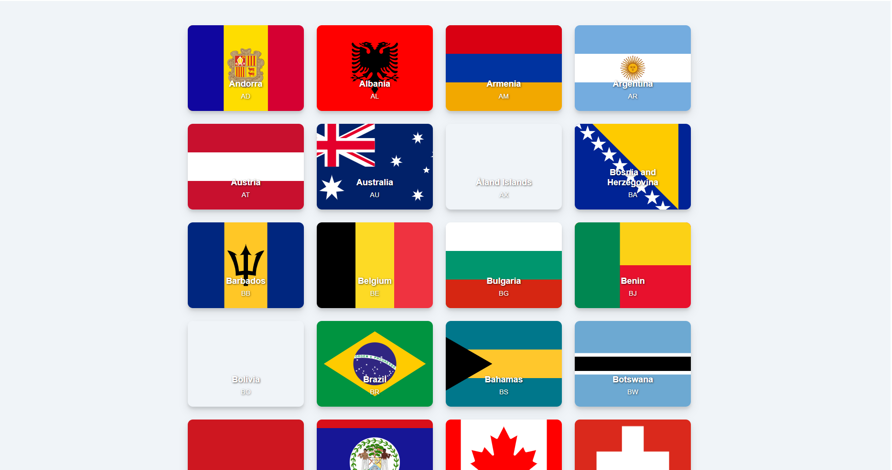
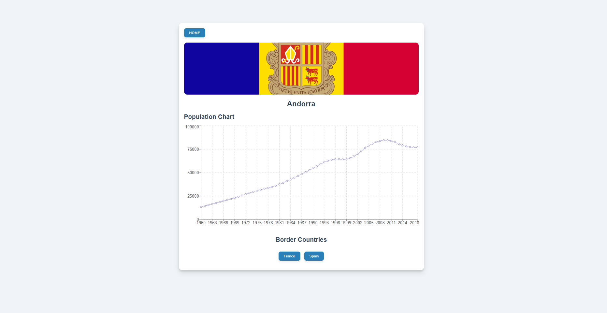
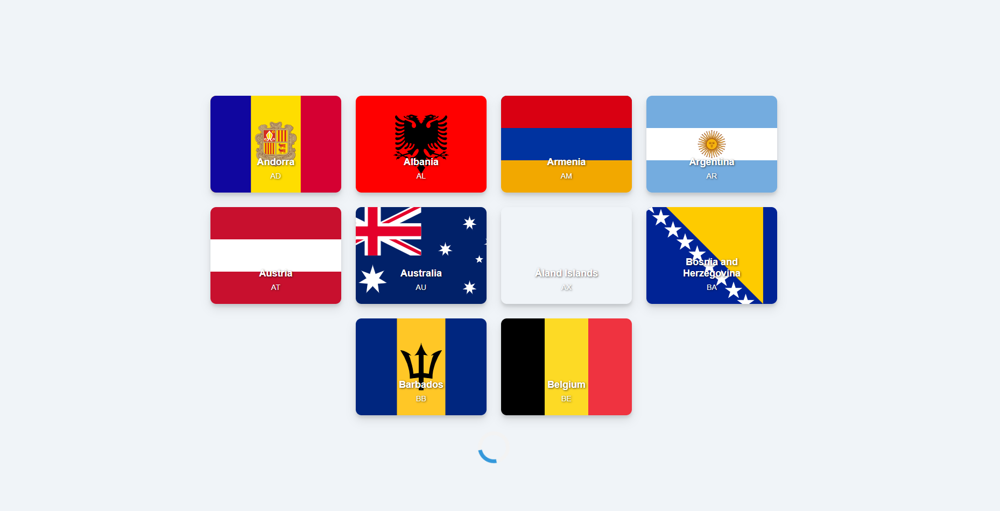
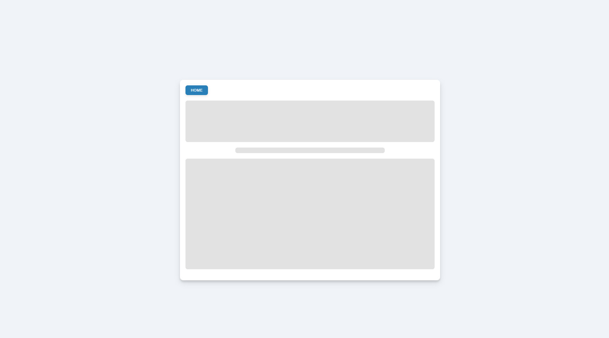

# Countries List Application

## Overview
This project is a full-stack web application providing a list of countries and detailed information about each, including its flag, border countries, and historical population data.

## Tech Stack
- **Backend**: Node.js with Express.js
- **Frontend**: React.js
- **API Integration**: Axios for HTTP requests, Recharts for data visualization, and Styled Components for styling.

## Features

### Backend
- **Available Countries Endpoint**
  - Fetches a list of available countries using the Date Nager API.
- **Country Info Endpoint**
  - Retrieves detailed information, including:
    - **Border Countries**: Fetched from Date Nager API.
    - **Population Data**: Obtained from Countries Now API.
    - **Flag URL**: Sourced from Countries Now API.

### Frontend
- **Country List Page**
  - Grid display of country cards with flags, names, and codes.
  - Infinite scrolling to load more countries.
  
  

- **Country Info Page**
  - Displays:
    - **Country Name and Flag**: Highlighted at the top.
    - **Population Chart**: Visualized with Recharts.
    - **Border Countries**: Clickable buttons for navigation.
    - A back button to return to the home page.
  
  

- **Loading and Skeletons**
  - Loaders and skeleton components ensure a smooth experience.
  
  
  

## Styling
Styled Components are used to deliver a responsive and modern design. Skeleton loaders and spinners provide a seamless loading experience.

## Repositories
- **Frontend**: [Frontend Repository URL](https://github.com/mateusmaiia/countries_list)
- **Backend**: [Backend Repository URL](https://github.com/mateusmaiia/countries_list_backend)

## API Documentation
- **Country List API**: [Nager.Date API Documentation](https://date.nager.at/swagger/index.html)
- **Country Info API**: [Postman API Documentation](https://documenter.getpostman.com/view/1134062/T1LJjU52)

---

## Environment Variables
- **Frontend**: `REACT_APP_BASE_URL` set to your backend URL.
- **Backend**: `PORT` and other configurations as needed.

---

## Libraries Used

### Frontend
- `axios`: For API requests.
- `react`: Main React library.
- `react-dom`: For rendering.
- `react-infinite-scroll-component`: Infinite scrolling.
- `react-router-dom`: Routing.
- `recharts`: Data visualization.
- `styled-components`: CSS-in-JS styling.

### Backend
- `axios`: API requests.
- `cors`: Cross-Origin Resource Sharing.
- `dotenv`: Environment variables.
- `express`: RESTful APIs.

### Dev Tools
- `eslint`: Code linting.
- `typescript`: Type checking.
- `vite`: Build tool.

---

## Code Quality
- ESLint and Prettier configured for consistent code style.
- All files are linted and formatted.
